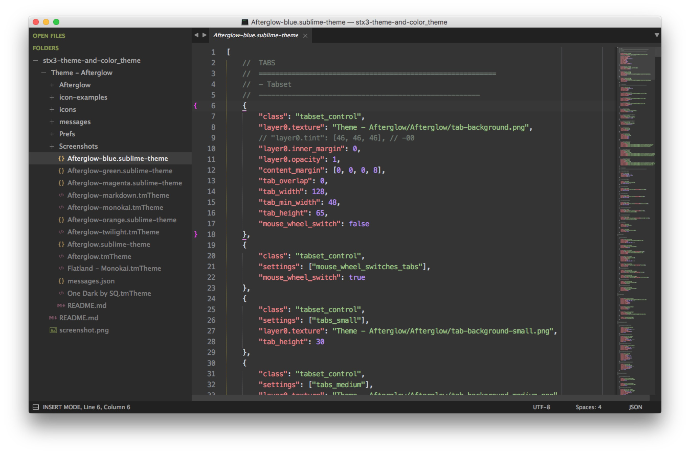

An custom theme and color_theme of Sublime Text 3
---

Based on Theme **[Afterglow](https://github.com/YabataDesign/afterglow-theme)**

Based on Color Theme **Flatland - Monokai.tmTheme**, edit with [tmTheme Editor](https://github.com/aziz/tmTheme-Editor)

### Screenshot



### Install

1. git clone https://github.com/whorusq/stx3-theme-and-color_theme
2. copy *Theme - Afterglow* to the Sublime Text 3 directory **/Packages**

    > click menu `Preferences > Browse Packages... `

### Theme settings

```json
    // Afterglow https://github.com/YabataDesign/afterglow-theme
    "theme": "Afterglow-green.sublime-theme",
    "color_scheme": "Packages/Theme - Afterglow/Flatland - Monokai.tmTheme",
    // "sidebar_no_icon": true,
    "sidebar_size_13": true,
    "sidebar_row_padding_medium": true,
    "folder_no_icon": true,
    "tabs_small": true,
    "tabs_padding_small": true,
    "tabs_padding_medium": true,
    // "tabs_label_not_italic": true,
    "status_bar_brighter": true,
    "color_inactive_tabs": true,
```
